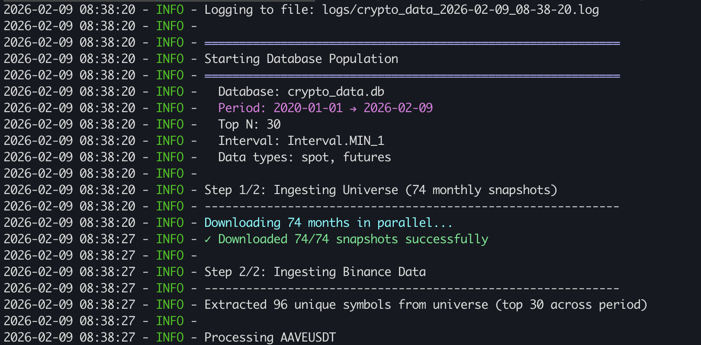

# 📊 Crypto Data

> **Français** | **[English](README.md)**

**Infrastructure de données pour la cryptomonnaie** - Téléchargement automatique des données OHLCV Binance et classements de marché.

[](https://opensource.org/licenses/MIT)
[](https://www.python.org/downloads/)
[](https://github.com/qu4ant/crypto-data/releases/tag/v5.0.0)
[](https://codecov.io/gh/qu4ant/crypto-data)
[](https://github.com/qu4ant/crypto-data/actions)

📺 Plus d'outils et tuto ici -> [Guillaume Algo Trading](https://www.youtube.com/@GuillaumeAlgoTrading)

---

## 🎯 Vue d'ensemble

**Crypto Data** est un pipeline d'ingestion qui télécharge automatiquement les données de marché crypto et les stocke dans une base de données DuckDB locale.

✨ **Philosophie** : Ce package fait **UNE chose** - peupler une base de données. Vous interrogez ensuite directement la base avec SQL.

### Fonctionnalités principales

- 📈 **Données OHLCV** : Téléchargement depuis Binance Data Vision (spot + futures)
- 🌍 **Classements univers** : Top N cryptos par capitalisation via CoinMarketCap
- 🚀 **Téléchargements asynchrones** : 20 téléchargements parallèles pour vitesse maximale
- 🔄 **Gestion automatique** : Détection de format, retry intelligent, gestion des tokens 1000-prefix
- 💾 **DuckDB** : Base de données embarquée, requêtes SQL rapides
- 🏗️ **Binance exclusif** : Le seul exchange fournissant des données historiques gratuites et complètes (OHLCV, takers, open interest, funding rates, tick data, aggregated trades)

**Sortie console :**



---

## 🔄 Schéma Input/Output

```
┌───────────────────────────────────────────────────────────┐
│                         INPUTS                            │
├───────────────────────────────────────────────────────────┤
│                                                           │
│  CoinMarketCap API                                        │
│  └─> Classements top N par capitalisation                 │
│      (résout le biais du survivant)                       │
│                                                           │
│  Binance Data Vision                                      │
│  └─> Données OHLCV historiques                            │
│      (spot + futures, intervalles 5m/1h/4h/1d)            │
│                                                           │
└───────────────────────────────────────────────────────────┘
                            ↓
┌───────────────────────────────────────────────────────────┐
│                   CRYPTO-DATA PIPELINE                    │
│                                                           │
│  - Téléchargement asynchrone (20 threads)                 │
│  - Auto-détection format timestamps                       │
│  - Gestion 1000-prefix (PEPE, SHIB, BONK)                 │
│  - Transaction atomique par symbole                       │
│                                                           │
└───────────────────────────────────────────────────────────┘
                            ↓
┌───────────────────────────────────────────────────────────┐
│                         OUTPUT                            │
├───────────────────────────────────────────────────────────┤
│                                                           │
│  crypto_data.db (DuckDB)                                  │
│                                                           │
│  Tables:                                                  │
│  - crypto_universe  -> Classements historiques            │
│  - spot             -> Prix OHLCV spot                    │
│  - futures          -> Prix OHLCV futures                 │
│                                                           │
│  Vous interrogez avec SQL:                                │
│                                                           │
│  SELECT symbol, close, volume                             │
│  FROM spot                                                │
│  WHERE exchange = 'binance'                               │
│    AND symbol = 'BTCUSDT'                                 │
│    AND interval = '1h'                                    │
│    AND timestamp >= '2024-01-01'                          │
│                                                           │
└───────────────────────────────────────────────────────────┘
```

---

## ⚠️ Pourquoi ce projet? Le biais du survivant

### Le problème

Imaginez que vous analysez les cryptos en **ne prenant que les top 100 d'aujourd'hui**. Votre analyse ignore complètement les cryptos qui étaient dans le top 100 avant mais ont disparu :

- **FTX Token (FTT)** : #25 en 2022, effondrement en novembre 2022
- **Terra LUNA** : #10 en 2022, crash catastrophique en mai 2022
- **Bitconnect (BCC)** : Top crypto, scam révélé en 2018

Si vous n'incluez pas ces cryptos dans votre backtest, vos résultats seront **artificiellement optimistes** - c'est le **biais du survivant**.

### La solution : CoinMarketCap + Stratégie UNION

✅ **crypto-data** résout ce problème en :

1. **Téléchargeant les classements historiques** via CoinMarketCap chaque mois
2. **Utilisant une stratégie UNION** : récupère TOUS les symboles qui ont été dans le top N **à n'importe quel moment** de la période

> **Note point-in-time** : cet ensemble UNION sert à la **couverture de
> téléchargement**, pas à considérer tous les symboles comme tradables dès le
> premier jour. Workflow sûr : télécharger le superset une fois, puis filtrer
> mois par mois (ou rebalancement par rebalancement) avec `crypto_universe`
> pour construire l'univers investissable.

**Exemple concret** :
```python
# Top 100 sur 12 mois
get_binance_symbols_from_universe(
    db_path='crypto_data.db',
    start_date='2024-01-01',
    end_date='2024-12-31',
    top_n=100
)
# Résultat : ~120-150 symboles
# (100 actuels + entrées/sorties du top 100)
```

Vous capturez ainsi **toute la dynamique du marché** : entrées, sorties, échecs, delistings.

**Important pour le backtesting** : Les cryptos avec des gaps de données à la fin (delistées) doivent être conservées dans les backtests même si elles n'apparaissent que dans le training set. Cela reflète les conditions réelles du marché et évite le biais du survivant - les cryptos ayant échoué font partie de la réalité dont vous devez apprendre.

---

## 🚀 Installation

### Installation depuis GitHub (Recommandé)

```bash
# Installer la dernière version depuis main
pip install git+https://github.com/qu4ant/crypto-data.git

# Ou installer une version spécifique
pip install git+https://github.com/qu4ant/crypto-data.git@v4.0.0
```

### Installation depuis les sources

```bash
# Cloner et installer en mode développement
git clone https://github.com/qu4ant/crypto-data.git
cd crypto-data
pip install -e .

# Pour le développement avec outils de test
pip install -e ".[dev]"
```

### Installation PyPI

> **Bientôt disponible** : `pip install crypto-data` sera disponible après publication sur PyPI

**Dépendances** : Python 3.10+, duckdb, aiohttp, pandas, pyarrow

---

## 💻 Démarrage rapide

> **Conseil** : Téléchargez les données 1 minute une fois, puis agrégez vers l'intervalle souhaité (5m, 1h, 4h...)
> avec SQL. C'est plus rapide et flexible que de télécharger plusieurs intervalles séparément.

### Option 1 : Workflow complet avec `create_binance_database()`

La fonction `create_binance_database()` fait tout en un appel : télécharge l'univers + données OHLCV.

```python
from crypto_data import create_binance_database, setup_colored_logging, DataType, Interval

# Logs colorés (optionnel mais recommandé)
setup_colored_logging()

# Téléchargement complet
create_binance_database(
    db_path='crypto_data.db',
    start_date='2024-01-01',
    end_date='2024-12-31',
    top_n=100,                    # Top 100 par capitalisation
    interval=Interval.HOUR_1,     # Utiliser l'enum Interval (MIN_5, HOUR_1, HOUR_4, DAY_1, etc.)
    data_types=[DataType.SPOT, DataType.FUTURES],  # Utiliser l'enum DataType
    # Par défaut: exclut stablecoins, wrapped tokens et actifs tokenisés
    exclude_symbols=['LUNA', 'FTT', 'UST']  # Exclusions additionnelles optionnelles
)
```

### Option 2 : Étape par étape

```python
import asyncio
from crypto_data import (
    update_coinmarketcap_universe,
    get_binance_symbols_from_universe,
    update_binance_market_data,
    setup_colored_logging,
    DataType,
    Interval
)

setup_colored_logging()

# 1. Télécharger classements CoinMarketCap (async, téléchargements parallèles)
asyncio.run(update_coinmarketcap_universe(
    db_path='crypto_data.db',
    dates=['2024-01-01', '2024-02-01', '2024-03-01'],  # Liste de dates de snapshots
    top_n=100,
    # Par défaut: exclut stablecoins, wrapped tokens et actifs tokenisés
    exclude_symbols=[]
))

# 2. Extraire symboles avec stratégie UNION
symbols = get_binance_symbols_from_universe(
    db_path='crypto_data.db',
    start_date='2024-01-01',
    end_date='2024-12-31',
    top_n=100
)
# Superset pour le téléchargement uniquement :
# conserver le filtrage point-in-time avec crypto_universe ensuite.

# 3. Télécharger données Binance (asynchrone)
update_binance_market_data(
    db_path='crypto_data.db',
    symbols=symbols,
    start_date='2024-01-01',
    end_date='2024-12-31',
    data_types=[DataType.SPOT, DataType.FUTURES],  # Utiliser l'enum DataType
    interval=Interval.HOUR_1  # Utiliser l'enum Interval (MIN_5, HOUR_1, HOUR_4, DAY_1, etc.)
)
```

---

## 🔐 Énumérations Type-Safe

Tous les paramètres de type de données et d'intervalle utilisent des énumérations pour la sécurité de type et l'autocomplétion IDE.

```python
from crypto_data import DataType, Interval

# Enum DataType
DataType.SPOT           # OHLCV marché spot
DataType.FUTURES        # OHLCV marché futures
DataType.OPEN_INTEREST  # Open interest futures (journalier)
DataType.FUNDING_RATES  # Taux de financement (8h)

# Enum Interval
Interval.MIN_1, MIN_5, MIN_15, MIN_30
Interval.HOUR_1, HOUR_2, HOUR_4, HOUR_6, HOUR_8, HOUR_12
Interval.DAY_1, DAY_3, WEEK_1, MONTH_1
```

> **Conseil** : Préférez télécharger `MIN_1` et agréger avec SQL vers d'autres timeframes.
> Cela évite de re-télécharger les données pour chaque intervalle.

> **📦 Source de données** : Tous les types de données sont téléchargés depuis **Binance Data Vision** (archives historiques officielles). Binance est le seul exchange qui fournit gratuitement des données historiques complètes (OHLCV, takers, open interest, funding rates, tick data, aggregated trades).
> Le pipeline utilise des **fichiers ZIP mensuels** pour les mois complets passés (plus rapide, moins de requêtes HTTP) et
> des **fichiers ZIP journaliers** pour les jours du mois en cours lorsque les fichiers mensuels ne sont pas encore disponibles.
> C'est important pour l'Open Interest et les Funding Rates, car l'API REST Binance ne fournit que les données récentes (~6 mois),
> tandis que Data Vision a des années d'historique.
>
> **Fraîcheur automatique des klines** : l'ingestion OHLCV spot/futures choisit
> automatiquement la meilleure archive. Les mois historiques utilisent les
> fichiers mensuels ; les jours récents utilisent les fichiers journaliers, et
> les 3 derniers fichiers journaliers disponibles sont rafraîchis pour capter
> d'éventuelles corrections tardives. Aucun paramètre supplémentaire n'est requis.

---

## 📊 Exemples de requêtes SQL

Une fois les données téléchargées, interrogez directement avec SQL (DuckDB, pandas, Jupyter...).

### 1. Liste des symboles disponibles

```sql
SELECT DISTINCT symbol, COUNT(*) as nb_rows
FROM spot
WHERE exchange = 'binance'
  AND interval = '1h'
GROUP BY symbol
ORDER BY nb_rows DESC;
```

### 2. Historique de prix Bitcoin

```sql
-- Note : timestamp = heure de clôture de la bougie
SELECT
    timestamp,
    open,
    high,
    low,
    close,
    volume
FROM spot
WHERE exchange = 'binance'
  AND symbol = 'BTCUSDT'
  AND interval = '1h'
  AND timestamp >= '2024-01-01'
ORDER BY timestamp;
```

### 3. Joindre univers + prix (capitalisation)

```sql
SELECT
    u.date,
    u.symbol,
    u.rank,
    u.market_cap,
    s.close,
    s.volume
FROM crypto_universe u
JOIN spot s
  ON u.symbol || 'USDT' = s.symbol
  AND u.date = DATE_TRUNC('day', s.timestamp)
WHERE s.exchange = 'binance'
  AND s.interval = '1h'
  AND u.date >= '2024-01-01'
ORDER BY u.date, u.rank;
```

### 4. Top 10 cryptos par volume (24h)

```sql
SELECT
    symbol,
    SUM(volume) as volume_24h,
    AVG(close) as avg_price
FROM spot
WHERE exchange = 'binance'
  AND interval = '1h'
  AND timestamp >= NOW() - INTERVAL '24 hours'
GROUP BY symbol
ORDER BY volume_24h DESC
LIMIT 10;
```

### 5. Vérifier quand une crypto était dans le top N

```sql
-- Trouver quand TON est entré/sorti du top 50
SELECT date, symbol, rank, market_cap
FROM crypto_universe
WHERE symbol = 'TON'
  AND date >= '2024-01-01'
  AND rank <= 50
ORDER BY date;
```

> **Important** : Utilisez la table `crypto_universe` pour vérifier les classements, PAS les tables spot/futures. Les barres de progression montrent la disponibilité des données Binance (ex: données TON à partir d'août 2024), pas quand la crypto est entrée dans le top N (juin 2024).
>
> **Rappel PIT** : `get_binance_symbols_from_universe()` est volontairement plus large
> qu'un univers tradable. Utilisez-le pour être sûr de tout télécharger, puis
> appliquez le vrai filtre top N depuis `crypto_universe` à chaque
> mois/date de rebalancement.

### 6. Interroger plusieurs intervalles depuis la même base

```sql
-- Comparer les données 1h vs 4h pour le même symbole
SELECT
    interval,
    COUNT(*) as nb_candles,
    MIN(timestamp) as first_date,
    MAX(timestamp) as last_date
FROM spot
WHERE exchange = 'binance'
  AND symbol = 'BTCUSDT'
  AND interval IN ('1h', '4h')
GROUP BY interval;
```

> **Note** : Vous pouvez stocker plusieurs intervalles (5m, 1h, 4h, etc.) dans la même base de données. Chaque intervalle est stocké comme une ligne séparée avec une clé primaire différente.

---

## 🚀 Exports directs depuis la base (Plus rapide que l'API)

Une fois les données ingérées, vous pouvez interroger directement les tables `spot` et `futures` pour vos propres exports - **beaucoup plus rapide que d'appeler l'API Binance à répétition**.

### Cas d'usage

- 📊 Export vers CSV/Parquet pour pipelines de machine learning
- 📈 Créer des agrégations personnalisées (VWAP journalier, volatilité glissante, etc.)
- 🖥️ Construire des tableaux de bord temps réel avec connexions en lecture seule
- 🔍 Analytics avancées sur les données historiques Binance

### Exemple : Export vers DataFrame Pandas

```python
import duckdb

# Connexion à la base (mode lecture seule)
conn = duckdb.connect('crypto_data.db', read_only=True)

# Export des données BTC 1h pour 2024
df = conn.execute("""
    SELECT timestamp, open, high, low, close, volume
    FROM spot
    WHERE exchange = 'binance'
      AND symbol = 'BTCUSDT'
      AND interval = '1h'
      AND timestamp >= '2024-01-01'
    ORDER BY timestamp
""").df()

# Sauvegarder en Parquet (rapide, compressé)
df.to_parquet('btc_2024_1h.parquet')

conn.close()
```

### Performance

**Les requêtes DuckDB sur la base locale sont 10-100x plus rapides que les appels API**, avec **aucune limite de débit**.

- ✅ **Pas de rate limiting** : requêtes illimitées
- ✅ **Accès instantané** : pas de latence réseau
- ✅ **Agrégations complexes** : analytics basées sur SQL
- ✅ **Export Parquet** : optimisé pour les pipelines ML

---

## 🗄️ Schéma de base de données (v4.0.0)

Un seul fichier : `crypto_data.db`

### Table `crypto_universe` - Classements historiques

Stocke les classements CoinMarketCap (top N par capitalisation).

| Colonne      | Type      | Description                                      |
|--------------|-----------|--------------------------------------------------|
| `date`       | DATE      | Date du classement (mensuel)                     |
| `symbol`     | VARCHAR   | Symbole base (BTC, ETH, pas BTCUSDT)             |
| `rank`       | INTEGER   | Classement par capitalisation                    |
| `market_cap` | DOUBLE    | Capitalisation en USD                            |
| `categories` | VARCHAR   | Tags CoinMarketCap (stablecoin, DeFi, etc.)      |

**Clé primaire** : `(date, symbol)`
**Index** : `(date, rank)`

> **Interprétation des timestamps** : Une date comme `2024-01-01 00:00:00.000` signifie que la crypto était dans le top N pour **TOUT le mois** de janvier 2024 (snapshot mensuel pris le 1er).
>
> **Fréquence de mise à jour** : Les snapshots sont pris le **1er de chaque mois UNIQUEMENT** (pas de mises à jour quotidiennes/hebdomadaires). Pour remplir 12 mois, vous avez besoin de 12 appels API.

### Tables `spot` et `futures` - Données OHLCV

Données de prix historiques depuis Binance.

| Colonne           | Type      | Description                                   |
|-------------------|-----------|-----------------------------------------------|
| `exchange`        | VARCHAR   | Exchange ('binance')                          |
| `symbol`          | VARCHAR   | Paire de trading (BTCUSDT, ETHUSDT, etc.)     |
| `interval`        | VARCHAR   | Intervalle (5m, 15m, 30m, 1h, 2h, 4h, 6h, 8h, 12h, 1d, 3d, 1w, 1M) |
| `timestamp`       | TIMESTAMP | Timestamp de clôture de la bougie             |
| `open`            | DOUBLE    | Prix d'ouverture                              |
| `high`            | DOUBLE    | Prix maximum                                  |
| `low`             | DOUBLE    | Prix minimum                                  |
| `close`           | DOUBLE    | Prix de clôture                               |
| `volume`          | DOUBLE    | Volume en base asset                          |
| `quote_volume`    | DOUBLE    | Volume en quote asset (USDT)                  |
| `trades_count`    | INTEGER   | Nombre de trades                              |
| `taker_buy_*`     | DOUBLE    | Volumes d'achat taker                         |

**Clé primaire** : `(exchange, symbol, interval, timestamp)`
**Index** : `(exchange, symbol, interval, timestamp)`

> **Interprétation du timestamp OHLCV** : `timestamp` correspond à l'heure de
> **clôture** de la bougie. Exemple : pour une bougie `5m` couvrant
> `00:00 -> 00:05`, le timestamp stocké est `00:05:00`, pas `00:00:00`.

> **Support multi-intervalle** : Vous pouvez stocker plusieurs intervalles (5m, 1h, 4h, etc.) dans la même base de données simultanément. Chaque intervalle est stocké comme une ligne séparée avec une clé primaire différente. Interrogez en filtrant avec `WHERE interval = '5m'`.

---

## 🔧 Fonctionnalités avancées

### 🤖 Gestion automatique intelligente

Le pipeline gère automatiquement plusieurs problèmes de données :

#### 1. **Formats de timestamps variables**
- 2024 : millisecondes (13 chiffres)
- 2025 : microsecondes (16 chiffres)
- ✅ Détection automatique et conversion

#### 2. **En-têtes CSV inconsistants**
- Certains fichiers ont des en-têtes, d'autres non
- ✅ Détection automatique par analyse de la première ligne

#### 3. **Tokens 1000-prefix (PEPE, SHIB, BONK)**
- Futures : `1000PEPEUSDT`, Spot : `PEPEUSDT`
- ✅ Retry automatique avec prefix, normalisation dans la base

#### 4. **Détection de delisting**
- FTT delisté en novembre 2022
- ✅ Arrêt après 3 échecs consécutifs (seuil configurable)

### 🎯 Décisions de design

**Binance uniquement** : Binance est le seul exchange qui partage gratuitement des données historiques complètes (OHLCV, takers, open interest, funding rates, tick data, aggregated trades). Aucun autre exchange ne fournit ce niveau d'accès gratuit aux données.

**Rebrands = symboles séparés** : MATIC→POL, RNDR→RENDER traités différemment
- Raison : interruptions de trading, fichiers séparés, liquidité différente
- Solution : requêtes UNION pour combiner les périodes

**Stratégie UNION** : capture TOUS les symboles du top N sur la période
- ~120-150 symboles pour top 100 sur 12 mois
- Évite le biais du survivant

**Filtres d'univers par défaut** : stablecoins, wrapped tokens et actifs tokenisés exclus
- `exclude_tags=[]` désactive explicitement ces exclusions par défaut
- `exclude_symbols` permet d'ajouter des tickers à exclure au cas par cas

---

## 🔄 Transformations de données

Le pipeline applique les transformations suivantes aux données brutes Binance. **Aucune autre modification n'est effectuée** - les prix, volumes et compteurs sont stockés exactement comme reçus.

| Transformation | Donnée brute | Donnée stockée | Raison |
|----------------|--------------|----------------|--------|
| **Arrondi timestamp** | `1704067499999` ms → `2024-01-01 00:04:59.999` | `2024-01-01 00:05:00` | Ceil à 1 seconde évite les `.999` millisecondes |
| **Unité timestamp** | Millisecondes (13 chiffres) ou microsecondes (16 chiffres) | datetime | Auto-détecté via seuil `>= 5e12` |
| **Symboles 1000-prefix** | `1000PEPEUSDT` (fichier futures) | `PEPEUSDT` | Stocké avec symbole original pour cohérence |
| **Noms de colonnes** | Casse mixte (`Open`, `OPEN`) | minuscules (`open`) | Normalisé pour requêtes cohérentes |
| **Renommage colonne** | `count` | `trades_count` | Certains fichiers utilisent `count` |
| **Colonnes manquantes** | (absentes) | `NULL` | Colonnes `taker_buy_*` ajoutées comme NULL si manquantes |
| **Doublons** | Plusieurs lignes même timestamp | Ligne unique | Dédupliqué sur clé primaire avant insertion |

**Ce qui n'est PAS modifié :**
- Prix OHLC (open, high, low, close)
- Volume et quote_volume
- Nombre de trades
- Toutes les valeurs numériques
- Les gaps de données restent des gaps - les utilisateurs doivent gérer cela dans leur analyse/backtesting

---

## ⚠️ Limitations connues

### Contraintes techniques

**Single-writer only** : DuckDB ne supporte qu'un seul processus d'écriture à la fois
- ✅ Lectures concurrentes illimitées OK
- ❌ Exécuter plusieurs `create_binance_database()` en parallèle → erreur de lock
- **Solution** : Lancer une seule instance à la fois

**Espace disque minimum** : ~50GB recommandé pour top 100 sur 1 an
- 5m interval : ~30GB (105k candles/mois × 100 symboles)
- 1h interval : ~5GB
- Temp files durant téléchargement : +10-20GB additionnels
- **Solution** : Utiliser interval plus large (1h/4h au lieu de 5m) ou réduire `top_n`

**API Rate Limits** : ingestion CoinMarketCap protégée par un limiteur sliding-window
- Limiteur par défaut : 200 calls / 24h (conservateur)
- Universe ingestion : 1 call par date de snapshot
- **Conseil** : utiliser `skip_existing_universe=True` pour reprendre après interruption.
  Ce skip se fait uniquement par date. Si vous changez `top_n`,
  `exclude_tags` ou `exclude_symbols` pour des dates déjà présentes, relancez
  avec `skip_existing_universe=False` pour reconstruire ces snapshots.

### Comportement re-run (Idempotency)

✅ **Safe** : Re-exécuter plusieurs fois est sûr et idempotent

- **Universe** : DELETE + INSERT atomique par date de snapshot quand elle est
  rafraîchie. Avec `skip_existing_universe=True`, les dates déjà présentes sont
  skippées sans vérifier si `top_n` ou les filtres ont changé.
- **Binance** : Skip automatique si données existent (`skip_existing=True` par défaut)
- **Transactions** : Atomic par symbole (all-or-nothing, rollback automatique si erreur)

⚠️ **Interruption** : Si process tué mid-run (Ctrl+C, crash)

- Données déjà committées : conservées (safe)
- Données en cours : rollback automatique (safe)
- **Limitation** : Pas de resume/checkpoint → restart from scratch
- **Workaround** : Diviser en batches mensuels plus petits

### Validation de données

✅ **Protection contre corruption** : Validation automatique depuis v4.0.0

- **Validation pre-import** : Pandera schema check AVANT insertion (OHLC relationships, prix négatifs, etc.)
- **Validation downloads** : Content-Length check + ZIP integrity verification
- **Fichiers rejetés** : Logged avec message clair (pas d'import silencieux de données invalides)

❌ **Pas de retry automatique** : Downloads échoués nécessitent re-run manuel

- Partial downloads/corrupt ZIPs → Retourne False (non importé)
- **Solution** : Re-lancer `create_binance_database()` ou `update_binance_market_data()` → skip existing + retry failed

### Source de données : Binance Data Vision vs API REST

Ce package télécharge depuis **Binance Data Vision** (archives ZIP officielles), pas l'API REST.

| Type de données | Data Vision (ce package) | API REST |
|-----------------|--------------------------|----------|
| OHLCV (spot/futures) | Historique complet (années) | Historique complet |
| Open Interest | Historique complet (années) | Récent uniquement (~30 jours) |
| Funding Rates | Historique complet (années) | ~6 mois maximum |

**Avantage** : Vous obtenez l'historique complet qui n'est pas disponible via l'API REST.

**Référence** : [Documentation API Binance](https://developers.binance.com/docs/derivatives/usds-margined-futures/market-data/rest-api/Open-Interest-Statistics)

---

## 🔧 Troubleshooting

### Erreur : "Database is locked"

**Cause :** Plusieurs processus tentent d'écrire simultanément
**Solution :**
```bash
# Vérifier qu'une seule instance tourne
ps aux | grep python | grep crypto

# Tuer les processus en conflit si nécessaire
kill <PID>
```

### Erreur : "No space left on device"

**Cause :** Espace disque insuffisant (temp files + database)
**Solution :**
```python
# Option 1 : Libérer de l'espace
df -h  # Vérifier espace disponible

# Option 2 : Utiliser interval plus large
create_binance_database(interval=Interval.HOUR_1)  # Au lieu de Interval.MIN_5

# Option 3 : Réduire top_n
create_binance_database(top_n=50)  # Au lieu de 100
```

### Erreur : "429 Too Many Requests" (CoinMarketCap)

**Cause :** Rate limit API dépassé (trop de snapshots demandés dans une fenêtre 24h)
**Solution :**
```python
# Attendre reset de la fenêtre OU réduire le nombre de dates demandées
update_coinmarketcap_universe(
    dates=['2024-01-01', '2024-01-02'],  # Au lieu de grosses plages
    top_n=100
)
```

### Données manquantes pour certains symboles

**Cause :** Delisting détecté (`failure_threshold=3` par défaut)
**Comportement normal :** Arrête après 3 mois consécutifs manquants (ex: FTT après nov 2022)

```python
# Pour forcer le téléchargement complet (ignorer gaps)
update_binance_market_data(
    db_path='crypto_data.db',
    symbols=['FTTUSDT'],
    data_types=[DataType.SPOT],  # Utiliser l'enum DataType
    interval=Interval.HOUR_1,
    failure_threshold=0  # Désactive gap detection
)
```

### Erreur : "Data validation FAILED"

**Cause :** Fichier source corrompu (OHLC violation, prix négatifs, ZIP invalide)
**Solution :**
```bash
# 1. Vérifier les logs pour détails
# Exemple : "high < low" ou "negative price"

# 2. Re-télécharger (peut être temporaire)
python scripts/Download_data_universe.py

# 3. Si persistant, reporter sur GitHub Issues
# https://github.com/qu4ant/crypto-data/issues
```

### Performance lente (téléchargements)

**Cause :** Réseau lent ou trop de concurrence
**Solution :**
```python
# Réduire concurrence (par défaut: 20 klines, 100 metrics)
update_binance_market_data(
    max_concurrent_klines=10,  # Au lieu de 20
    max_concurrent_metrics=50   # Au lieu de 100
)
```

---

## 📚 Documentation supplémentaire

- 📖 [CLAUDE.md](CLAUDE.md) - Documentation technique complète pour développeurs
- 📓 [Jupyter Notebook](exemples/explore_crypto_data.ipynb) - Exemples de requêtes et visualisations
- 🐛 [GitHub Issues](https://github.com/qu4ant/crypto-data/issues) - Rapporter un bug

---

## 🧪 Tests

```bash
# Tous les tests
pytest tests/ -v

# Tests basiques uniquement
pytest tests/database/test_database_basic.py -v

# Avec couverture
pytest tests/ --cov=crypto_data --cov-report=html
```

---

## 📝 Licence

**MIT License** - Copyright (c) 2025 Crypto Data Contributors

Voir [LICENSE](LICENSE) pour les détails.

---

## 🤝 Contribution

Les contributions sont les bienvenues! Pour contribuer :

1. Fork le projet
2. Créez une branche feature (`git checkout -b feature/AmazingFeature`)
3. Commit vos changements (`git commit -m 'Add AmazingFeature'`)
4. Push vers la branche (`git push origin feature/AmazingFeature`)
5. Ouvrez une Pull Request

**Philosophie** : Simplicité > Fonctionnalités. Ce package fait **une chose** : ingestion de données. Pas de loaders/readers/query helpers.

---

## ⚡ Pourquoi crypto-data?

✅ **Simple** : Une fonction pour tout télécharger
✅ **Rapide** : 20 téléchargements parallèles
✅ **Fiable** : Retry automatique, gestion d'erreurs intelligente
✅ **Sans biais** : Stratégie UNION capture tous les symboles historiques
✅ **SQL-first** : Requêtes directes, pas d'abstraction inutile
✅ **Binance Data Vision** : La source de données historiques gratuites la plus riche disponible

---

**Développé avec ❤️ pour la communauté quant/crypto**
